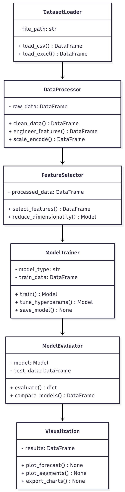

#### **📦Project Title**

📈 Retail Analytics \& Sales Forecasting System

#### **📦Description:**

A machine learning–powered analytics platform designed to help retail businesses analyze historical sales, clean and engineer data, run forecasting models, and segment stores or products. The project includes notebooks for exploration and modeling, along with visualization scripts and dashboard components.

Think of it as a toolkit for turning raw retail data into actionable business insights.

#### **📦Tech Stack:**

* Languages: Python
* Frameworks / Libraries: Pandas, NumPy, Scikit-Learn
* Jupyter Notebook
* Matplotlib / Seaborn for visualization(Potentially forecasting libs based on file structure: ARIMA, Prophet, etc.)
* Dashboard Component: Possibly Streamlit or similar (directory suggests one exists)
* Environment: Virtual environment included (venv/ folder)

#### **📦Installation:**

1. **Extract the ZIP**
   unzip retail\_analytics\_forecasting.zip
   cd retail\_analytics\_forecasting
   
2. **Create / Activate Virtual Environment (optional if included venv does not work)**
   python -m venv venv
   source venv/bin/activate   # Mac/Linux
   venv\\Scripts\\activate      # Windows
   
3. **Install Dependencies
   pip install -r requirements.txt**

#### **📦Usage:**

###### **Jupyter Notebook workflow**

###### 

1. **Start Jupyter:
   jupyter notebook**

2. **Open notebooks in the /notebooks/ folder Dashboard (if included)
   Run:
   python dashboard/app.py**

#### 

#### **📦Features:**

✔️ Data exploration using retail datasets

✔️ Data cleaning \& feature engineering pipelines

✔️ Machine learning forecasting notebook

✔️ Store/Product segmentation analysis

✔️ Visualization utilities for insights \& charts

✔️ Modular project structure for scalability

✔️ Dashboard folder for UI-based interaction

#### **📦Project Architecture:**

**┌───────────────────────────────────────────────────────────┐**

**│                    Retail Analytics System                │**

**└───────────────────────────────────────────────────────────┘**

                                **│**

                                **▼**

                  **┌───────────────────────────┐**

                  **│        Data Input         │**

                  **│  (CSV, Excel, API, etc.) │**

                  **└───────────────────────────┘**

                                **│**

                                **▼**

                  **┌───────────────────────────┐**

                  **│     Data Processing       │**

                  **│ - Cleaning                │**

                  **│ - Feature Engineering     │**

                  **│ - Scaling \& Encoding      │**

                  **└───────────────────────────┘**

                                **│**

                                **▼**

                  **┌───────────────────────────┐**

                  **│     Exploratory Analysis  │**

                  **│ - Charts/Visuals          │**

                  **│ - Summary Stats           │**

                  **└───────────────────────────┘**

                                **│**

                                **▼**

       **┌───────────────────────────────────────────────┐**

       **│                 Modeling Layer                │**

       **│  - Forecasting Models (ARIMA, Prophet, ML)   │**

       **│  - Clustering (Store/Product Segmentation)   │**

       **└───────────────────────────────────────────────┘**

                                **│**

                                **▼**

       **┌───────────────────────────────────────────────┐**

       **│               Evaluation \& Tuning             │**

       **│  - Model Validation                           │**

       **│  - Hyperparameter Tuning                      │**

       **└───────────────────────────────────────────────┘**

                                **│**

                                **▼**

       **┌───────────────────────────────────────────────┐**

       **│             Reporting \& Dashboard             │**

       **│  - Visual insights                            │**

       **│  - Forecast charts                            │**

       **│  - Export (CSV, PDF, UI Dashboard)            │**

       **└───────────────────────────────────────────────┘**

#### **📦 requirements.txt**

* **pandas==2.2.1**
* **numpy==1.26.4**
* **matplotlib==3.8.3**
* **seaborn==0.13.2**
* **scikit-learn==1.4.1**
* **statsmodels==0.14.2**
* **prophet==1.1.5**
* **joblib==1.3.2**
* **jupyter==1.0.0**
* **pyyaml==6.0.1**
* **tqdm==4.66.2**
* 
**\# (Optional) Dashboard/Interactive UI**

* **streamlit==1.31.1**
* 
**\# (Optional) File I/O / Utils**

* **openpyxl==3.1.2**

#### **Screenshots of Retail Analytics Forecasting**

  

